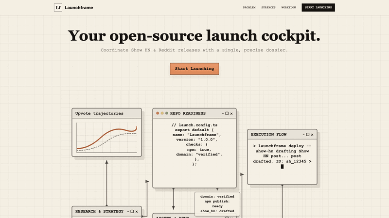

# Launchframe Dress Rehearsal

[](https://github.com/yueranyuan/launchframe-dress-rehearsal/actions/workflows/launch-context.yml)
[](https://www.npmjs.com/package/launchframe-dress-rehearsal)

This is a low-risk public rehearsal artifact for Launchframe, an OSS launch-control workspace for developer-tool launches.

The goal of this repo is to prove the external launch mechanics without pretending the rehearsal package is a production product.



## Live Surfaces

- Website: `https://launchframe.site/`
- npm package: `launchframe-dress-rehearsal@0.0.0-dress-rehearsal.0`
- Install smoke test: `npx launchframe-dress-rehearsal`
- Release: `v0.0.0-dress-rehearsal.0`

## What This Contains

- `index.html` and `assets/` for the static GitHub Pages site.
- `docs/PRIVACY.md`, `docs/TERMS.md`, and `docs/TELEMETRY.md` as rehearsal trust docs.
- `SECURITY.md`, `CONTRIBUTING.md`, `CODE_OF_CONDUCT.md`, and issue templates for repo-readiness practice.
- `launch-context/` as the auditable launch checklist/context bundle.
- `launch-context/POLICY-LAUNCH-GATE.md` as the explicit policy/contact/legal placeholder gate before any real launch.
- `repo/` as a copy of the filled launch-repo collateral used during the rehearsal.

## Validate The Rehearsal Context

```sh
node launch-context/scripts/validate-launch-context.mjs launch-context
```

The validator checks required launch artifacts, key `00-org-context.json` fields, current surface evidence, repo collateral, social preview assets, HTTPS status, and stale URL/package claims. It may warn about owner/legal-review placeholders because this is still a rehearsal.

Regenerate the evidence report:

```sh
node launch-context/scripts/generate-evidence-report.mjs launch-context
```

## Current Limits

- Launchframe is not yet a production product or public community.
- The npm package is intentionally harmless; it exists to exercise publish and install gates.
- Policy docs use rehearsal contacts and require owner/legal review before any production launch.
- Custom-domain HTTPS is enforced.
